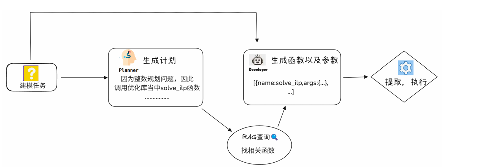

# AMML: An Adaptive Framework for Mathematical Modeling with LLMs

This repository provides the official implementation of the paper:***AMML: An Adaptive Framework for Mathematical Modeling with LLMs\***

<p align="center">    </p>

## 🚀 Quick Start

### 📦 Installation

Install all required dependencies using:

```bash
pip install -r requirements.txt
```

------

### 🔐 API Configuration

To use AMML with different LLM providers, configure the API in `utils/api.py`.
 For example:

```python
"doubao": {
    "base_url": "https://ark.cn-beijing.volces.com/api/v3",
    "api_key": "YOUR_API_KEY",
    "model": "doubao-1-5-pro-32k-250115"
}
```

> Pre-configured providers: `deepseek`, `qwen32`, `qwen72`, `kimi`, and `doubao`.

------

### 📁 Data Format

AMML supports four task types, each with specific input requirements:

#### 🔮 Prediction

Regression, classification, or time-series prediction tasks.

- `question.txt`: Task description.
- `train.csv`: Training data.
- `test.csv`: Test data (no target column). *Optional for time series.*

#### 📊 Evaluation

Rank subjects based on features.

- `question.txt`: Task description.
- `data.csv`: Optional related data.

#### 🧠 Optimization

Mathematical (e.g., Linear Programming) or graph-based (e.g., vertex coloring) problems.

- `question.txt`: Task description.
- `data.csv`: Optional related data.

#### ⚙️ Basic

Statistical analysis tasks like hypothesis testing or distribution testing.

- `question.txt`: Task description.
- `data.csv`: Optional related data.

------

### ▶️ Run the Pipeline

Use the following command to run AMML:

```bash
python ./pipeline.py --question ./test_case/o7/question.txt --type opt --agent deepseek --max_retries 3 --cover
```

**Arguments:**

- `--question`: Path to the question file.
- `--type`: Task type:
  - `opt` = optimization
  - `pre` = prediction
  - `eval` = evaluation
  - `basic` = statistical/basic task
- `--agent`: LLM provider (`deepseek`, `qwen32`, `qwen72`, `kimi`, `doubao`, etc.).
- `--max_retries`: Max retries for automatic code correction.
- `--cover`: Overwrite intermediate results (useful for re-running).

